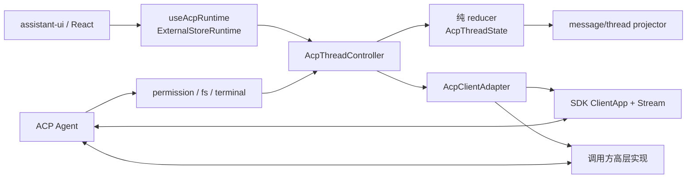

# 架构设计

## 状态所有权

`AcpThreadController` 只维护客户端投影，不创建第二份会话真相。每个 session 的消息、工具、权限、计划、命令、模式、配置、用量和未处理扩展完全隔离。reducer 不执行 I/O，因此历史重放、乱序更新和失败恢复可独立测试。

## 连接边界

- `stream`：`SdkAcpClientAdapter` 在连接前注册全部 Agent→Client handler，再调用官方 SDK 的 `ClientApp`。
- `adapter`：宿主负责实际传输和 Agent 生命周期，但必须提供同一套稳定方法及事件分发。
- 浏览器应用通常需要宿主或网关把 stdio Agent 转换为可用 Stream；这不属于本包职责。

## 投影规则

- 文本、图片、音频、reasoning 优先使用 assistant-ui 原生 part。
- tool call 使用 `acp:<kind>` 的稳定名称，原始输入、输出、内容和更新放入 artifact。
- permission 映射为 tool approval；plan、非 HTTP resource 和未知事件使用命名 `data-acp-*` part。
- 所有消息的原始 update 和 `_meta` 保存在 `metadata.custom.acp`。
