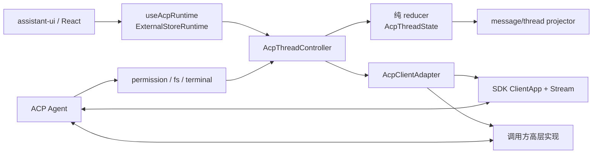

# 架构设计

## 状态所有权

`AcpThreadController` 只维护客户端投影，不创建第二份会话真相。每个 session 的消息、工具、权限、计划、命令、模式、配置、用量和未处理扩展完全隔离。reducer 不执行 I/O，因此历史重放、乱序更新和失败恢复可独立测试。

原始协议数据按归属保存：消息和工具保留自身完整 `SessionNotification`；plan、mode、config、commands、usage 与 session-info 保存最新完整通知；未知扩展保存完整通知。session 不再维护无限增长的全量 raw log，消息 metadata 也不复制 session 日志。

## 连接边界

- `stream`：`SdkAcpClientAdapter` 在连接前注册全部 Agent→Client handler，再调用官方 SDK 的 `ClientApp`。
- `adapter`：宿主负责实际传输和 Agent 生命周期，但必须提供同一套稳定方法及事件分发。
- 浏览器应用通常需要宿主或网关把 stdio Agent 转换为可用 Stream；这不属于本包职责。
- `authMethods` 仅表示 Agent 提供的认证方式。存在认证方式时优先查询可选 `authentication/status` 扩展；只有返回 `unauthenticated` 才进入登录门控，扩展不可用时兼容回退到传统门控。
- 每次连接有独立 generation。旧连接通知、关闭回调和异步结果不会进入新连接状态；重连 initialize/auth 后必须重新 load 当前 session，缺少 load 时才使用 resume。

## Session 生命周期

- controller 记录当前连接已挂载的 session；未挂载或挂载失败的 session 禁止发送 prompt。
- session 选择使用递增 generation，只有最新用户选择可以更新 active session；较晚完成的旧 load 历史仍保存在其原 session。
- load 前保存快照并暂时清空重放区域；失败恢复快照与 settled active session，允许重试。
- close 取消该 session 未决权限并解除挂载，但保留缓存历史；delete 才移除本地 session。
- `session/list` 完整遍历分页并对账非 active session；远端列表暂时缺少 active session 时仍保留当前界面状态。

## 投影规则

- 文本、图片、音频、reasoning 优先使用 assistant-ui 原生 part。
- tool call 使用 `acp:<kind>` 的稳定名称，原始输入、输出、内容和更新放入 artifact。
- permission 映射为 tool approval；plan、非 HTTP resource 和未知事件使用命名 `data-acp-*` part。
- `metadata.custom.acp` 只包含当前消息的 session ID、协议 message ID、完整原始 notifications、stop reason 和错误。
- 乐观用户消息保存真实 prompt content；live `user_message_chunk` 内容匹配时确认同一条本地消息并记录 `protocolMessageId`，保持 assistant-ui message ID 稳定。

## React 配置身份

连接、工作区、客户端服务、能力和 client info 在 controller 创建时固定。调用方改变这些身份配置时必须通过 React `key` 重建 Provider；回调使用 latest ref 动态生效。受控 `threadId` 同步不会回显 `onThreadIdChange`。
